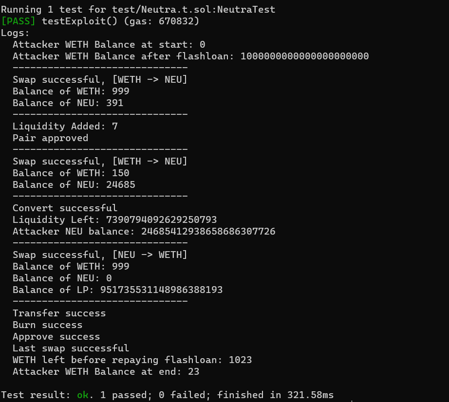

## Welcome to capturethefoundry

_capturethefoundry_ is a platform to practice foundry skills like writing PoCs and debugging. Every module relates to a real life exploit, and a successful completion of the task will mean reproducing an actual hack.

## Introduction

Hey researcher! I'm learning about the balancer flashloan but I don't really where to get started. I'm told that I have to **flashloan 10000 WETH**, but I just don't know what to do! Please help me write the `flashBalancer()` function on line 147 so that this flashloan thing works properly.

Good luck, researcher!

## Objectives

I believe every function works except for `flashBalancer()`, so please do not change or add anything else in other functions. 

1. Clone this repository locally (Make sure you have foundry installed)
2. Run the following command. The command should fail because of the flash loan is not working yet.  

```
    forge build
```
3. Code up the `flashBalancer()` function. Run this command when you have finished rectifying all the mistakes in the test suite.

```
    forge test --match-path test/Neutra.t.sol -vv
```

You should see this in your console once all the issues are fixed:



## Focus

Writing Code (Balancer Flashloan)

## Hints

I think there are four input parameter for the flashLoan function. I'm not sure what input types they are, maybe you can check the interface file in the test folder? The required variable types should be there. 

Also, 2 of the input types requires an array input... maybe try creating an array first?

If I'm not wrong, I don't think the data input really matter...

## Solution

The solution will be posted in the [solution](https://github.com/capturethefoundry/neutra/tree/main/solution/success.sol) folder at a later date.

## Context

The [NEUTRA protocol](https://twitter.com/phalcon_xyz/status/1686654241111429120) on the [Arbitrum](https://arbiscan.io/tx/0x6301d4c9f7ac1c96a65e83be6ea2fff5000f0b1939ad24955e40890bd9fe6122) network was hacked on August 1st 2023. The attacker ran away with ~23 Ether.

